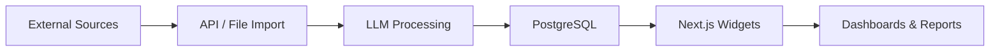

## 📚 Corporate Knowledge Base & BI System

<div align="center"><strong>Enterprise-grade data platform built with Next.js 15, Drizzle ORM & PostgreSQL</strong></div>
<div align="center">LLM-powered analytics, modular FSD widgets, blazing-fast performance</div>
<br />

[Demo](https://next-admin-dash.vercel.app/) · [Clone & Deploy](https://vercel.com/templates/next.js/admin-dashboard-tailwind-postgres-react-nextjs)

---

### 🗒️ Table of Contents
1. [Overview](#overview)
2. [Key Features](#key-features)
3. [Architecture](#architecture)
4. [Tech Stack](#tech-stack)
5. [Getting Started](#getting-started)
6. [Project Structure](#project-structure)
7. [Roadmap](#roadmap)
8. [Contributing](#contributing)

---

## Overview
Создаём единую корпоративную платформу для накопления, систематизации и анализа данных компании. Проект сочетает BI-отчётность, расширенную аналитику и управление знаниями, интегрируя LLM-модели на каждом этапе работы с данными.

**Core Mission:** предоставить сотрудникам мгновенный доступ к данным и инсайтам, ускорив принятие решений и снизив издержки на аналитику.

---

## Key Features
### Phase 1 — BI Foundation (✅ MVP готов)
- Excel/CSV импорт с умным сопоставлением колонок
- API-интеграции для потоковых данных
- Дашборды и отчёты в реальном времени
- LLM-подсказки и объяснения метрик

### Phase 2 — Advanced Analytics (🏗 planned)
- Предиктивные модели и аномалия-детекция
- Natural-language query interface
- Автоматическая генерация инсайтов

### Phase 3 — Knowledge Management (🗺 backlog)
- Обработка документов (PDF, DOCX, email)
- Семантический поиск по всей базе знаний
- AI-рекомендации и граф знаний

---

## Architecture
**Feature-Sliced Design (FSD)** гарантирует модульность и масштабируемость: каждый widget изолирован и может развиваться независимо.

```text
widgets/
├── llm-chat/               # AI-ассистент (MVP)
├── file-to-base-import/    # Импорт данных
└── …                       # Будущие BI-виджеты
```

Основной поток данных:



---

## Tech Stack
- **Frontend:** Next.js 15 (App Router), React 18, TypeScript, Tailwind CSS, Shadcn UI
- **Backend API:** Next.js API routes (future FastAPI micro-services)
- **Database:** PostgreSQL 14+, Drizzle ORM, SQL migrations
- **AI & LLM:** OpenAI API (GPT-4o), LangChain (planned), Vector DB (Qdrant/Weaviate)
- **State Management:** Zustand
- **Tooling:** pnpm, Prettier, ESLint, Vercel Analytics

> ⚠️ **Package manager:** используем _только_ **pnpm**.

---

## Getting Started
### Prerequisites
- Node.js 18+
- PostgreSQL 14+
- pnpm 8+

### Local Setup
```bash
# 1. Клонировать репозиторий
pnpm dlx degit your-org/next_app_dev my-bi-app && cd my-bi-app

# 2. Установить зависимости
pnpm install

# 3. Скопировать переменные окружения
cp .env.example .env.local
# и заполнить POSTGRES_URL, OPENAI_API_KEY …

# 4. Применить миграции и заполнить тестовые данные
pnpm db:push && pnpm seed:db

# 5. Запустить dev-сервер
pnpm dev
```

Приложение будет доступно на http://localhost:3000.

---

## Project Structure
```text
next_app_dev/
├── app/                 # Next.js routes (App Router)
├── widgets/             # FSD widgets
├── entities/            # Domain entities
├── shared/              # Общие библиотеки, utils, база данных
├── memory-bank/         # Архитектурная документация
└── …
```

---

## Roadmap
- [x] LLM Chat MVP
- [x] PostgreSQL + Drizzle интеграция
- [x] Production Item UI with real data
- [ ] OpenAI API интеграция
- [ ] Advanced analytics dashboards
- [ ] Document ingestion & semantic search

---

## Contributing
Pull requests welcome! Пожалуйста, следуйте FSD-архитектуре и убедитесь, что `pnpm lint && pnpm test` проходят без ошибок.

---

© 2025 Your Company — All rights reserved
